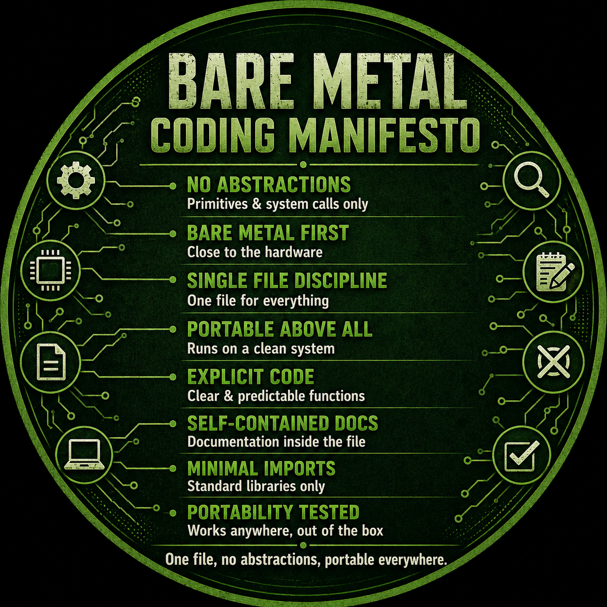

<!--

Here are some ideas to get you started:

- 🔭 I’m currently working on ...
- 🌱 I’m currently learning ...
- 👯 I’m looking to collaborate on ...
- 🤔 I’m looking for help with ...
- 💬 Ask me about ...
- 📫 How to reach me: ...
- 😄 Pronouns: ...
- ⚡ Fun fact: ...
-->

# chaito10

> One file. No abstractions. Portable everywhere.

## Philosophy

- No unnecessary abstractions
- Bare metal first
- Single-file applications
- Minimal dependencies
- Explicit code
- Self-contained documentation
- Portable by default

## Building

- Browser-first applications
- Self-contained tools
- Offline-first software
- Open-source utilities
- Experimental systems

## Principles

> Simplicity is a feature.

> Dependencies are a cost.

> Portability beats convenience.

> Readability outlives cleverness.

## Featured Projects

- 🍵 **PayMe** — Self-hosted UPI payment page
- 🏷️ **Badge** — Static badge generator
- 📚 **Wiki** — Personal knowledge base

## Current Focus

- Single-file web applications
- WebAssembly
- Peer-to-peer software
- Browser computing
- Local-first applications

---

*"Build less. Build better."*

  

